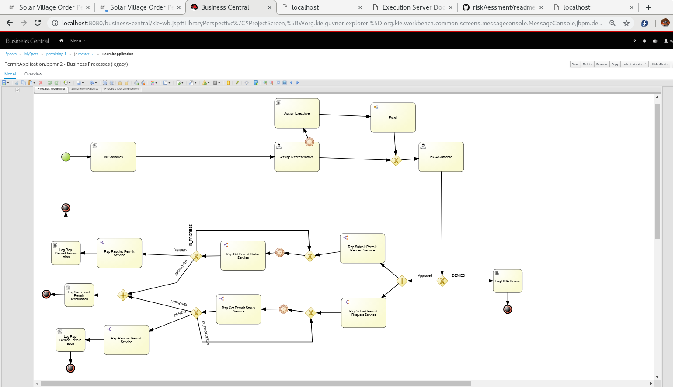
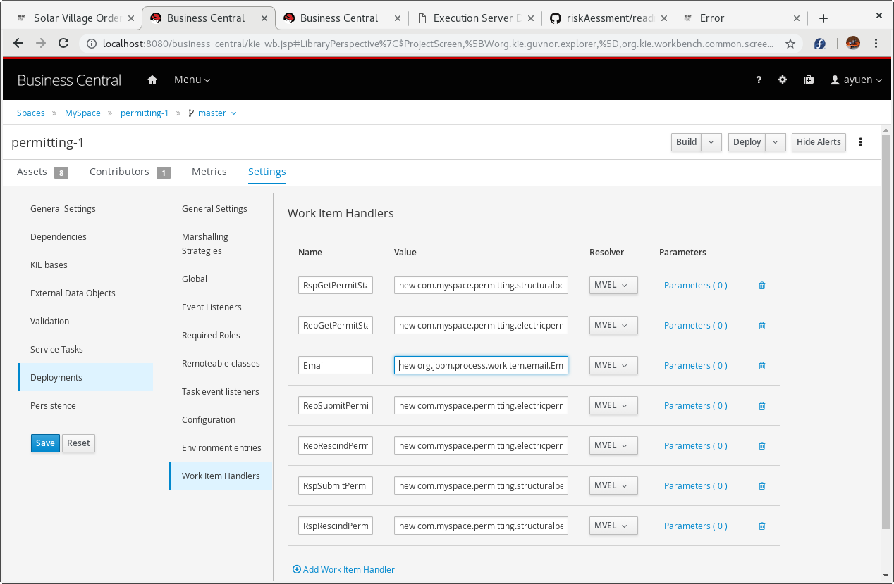
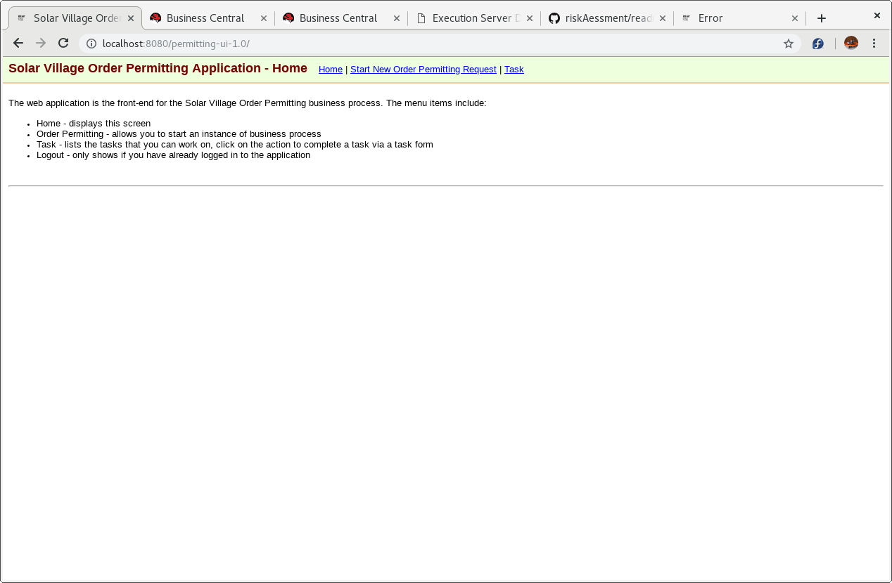
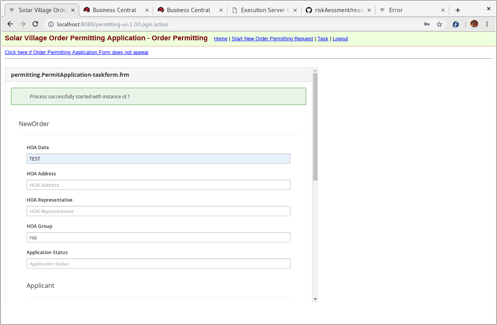
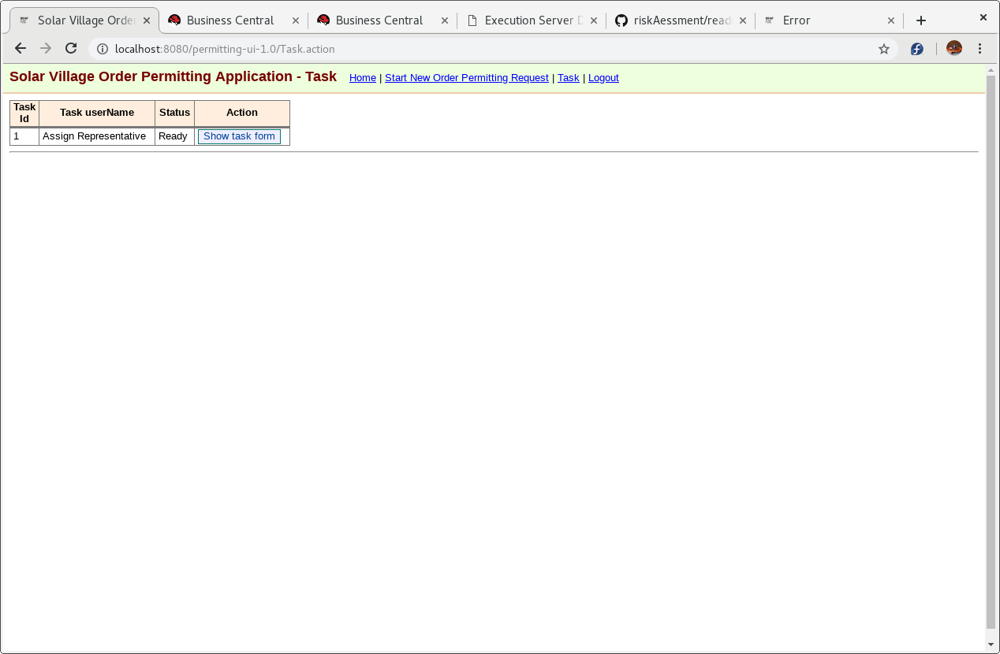
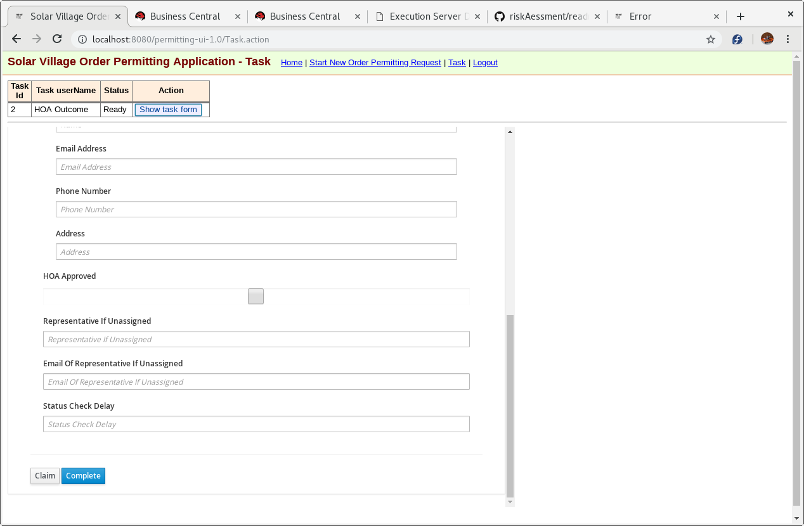

# 1. Solar Village Business Process
* Due to legacy bureaucratic red-tape with government permitting agencies, the life span of a new order permitting business process instance is typically several weeks.
* Many residences are members of a homeowner’s association, or HOA. For these residences:
* The HOA must approve any solar installation.
* Solar Village company policy requires a Solar Village representative from the sales department to attend an HOA meeting.
* If by one week prior to the HOA meeting no one from the sales department accepts the task, then the task is reassigned to an executive and an email is sent out.
* The HOA’s approval or denial of a solar installation request takes place at the HOA meeting that the Solar Village sales representative attends.
* For a residential solar installation, the following government permits are required:
 * Residential electric permit
 * Residential structural permit
* Fortunately, all government agencies provide remote online services that:
 * Accept new permit requests (for example, using HTTP PUT or HTTP POST)
 * Provide the status (such as APPROVED, DENIED, IN_PROGRESS) of that permit request (for example, using HTTP GET)
 * Allow for cancellation of that permit request (for example, using HTTP DELETE)
* The application for both electrical and structural permits can occur in parallel after approval from the HOA.
* If one of the permits is approved but the other is denied, then the approved permit must be rescinded.
* Once approvals from the HOA and both government agencies are received, the new order permitting business process is considered complete.

# 2. Environment
This POC uses the Red Hat Process Automation Manager (RHPAM) 7.3.0.GA running on JBOSS EAP 7.2 on a VM.

It is assumed that the customer has already set up a working RHPAM environment with Business Central and Kie-server.

# 3. Scope changes
Following the story line, the Consultant had an agreement with the customer on the POC scope changes. They are:
## 3.1 Use of RHPAM Data Modeller to re-create the Domain Model
The reasoning behind this decision is that the Solar Village domain model for the POC is so simple, it is just as simple to duplicate it in Business Central's Data Modeller. At the same time, the customer is happy to be introduced to use a new tool.

## 3.2 Customised WorkItemHandlers are to be use to emulate the government services
This makes it easier to assess the POC without getting into complex issues interfacing to government services. The WorkItemHandlers will accept the business process' domain model as input and convert it to the government services data model where required. This also simplifies the installation process so that the customer can spend less time on setting up the POC and more time on assessing the POC itself.

## 3.3 The customer will accept the cloning (from Github) of the order permitting business process from the Business Central UI
The customer agrees to import this project from Business Central.

## 3.4 The customer will accept the cloning (from Github) of the WorkItemHandlers and a web UI, then build and deploy them on to the RHPAM environment
The other two Github projects required to complete the POC are shown below. Follow the instructions in the links to complete the build and deploy.

https://github.com/AndyYuen/permitting
https://github.com/AndyYuen/permitting-services
https://github.com/AndyYuen/permitting-ui

# 4. Setup Instructions
## 4.1. Set up Users
Set up 2 users belonging to the group 'rep' short for representative.

Under jboss-eap-7.2/bin, run the ./add-user.sh script

./add-user.sh 


```
[ayuen@localhost bin]$ ./add-user.sh 

What type of user do you wish to add? 
 a) Management User (mgmt-users.properties) 
 b) Application User (application-users.properties)
(a): b

Enter the details of the new user to add.
Using realm 'ApplicationRealm' as discovered from the existing property files.
Username : executive
Password recommendations are listed below. To modify these restrictions edit the add-user.properties configuration file.
 - The password should be different from the username
 - The password should not be one of the following restricted values {root, admin, administrator}
 - The password should contain at least 8 characters, 1 alphabetic character(s), 1 digit(s), 1 non-alphanumeric symbol(s)
Password : 
Re-enter Password : 
What groups do you want this user to belong to? (Please enter a comma separated list, or leave blank for none)[  ]: rep,kie-server,rest-all
About to add user 'executive' for realm 'ApplicationRealm'
Is this correct yes/no? yes
Added user 'executive' to file '/home/ayuen/sw/rhpam7.3/jboss-eap-7.2/standalone/configuration/application-users.properties'
Added user 'executive' to file '/home/ayuen/sw/rhpam7.3/jboss-eap-7.2/domain/configuration/application-users.properties'
Added user 'executive' with groups rep,kie-server,rest-all to file '/home/ayuen/sw/rhpam7.3/jboss-eap-7.2/standalone/configuration/application-roles.properties'
Added user 'executive' with groups rep,kie-server,rest-all to file '/home/ayuen/sw/rhpam7.3/jboss-eap-7.2/domain/configuration/application-roles.properties'
Is this new user going to be used for one AS process to connect to another AS process? 
e.g. for a slave host controller connecting to the master or for a Remoting connection for server to server EJB calls.
yes/no? no


```
The do the same to create user1


To check ensure you have a role of salesman you can view user details either in the PAM console or through these files
jboss-eap-7.2/standalone/configuration/application-roles.properties
jboss-eap-7.2/standalone/configuration/application-users.properties


## 4.2. Configure Maven repository

Either change your maven settings.xml to set up access to redhat repositories or download the maven repository for PAM 7.3 using the link below:
https://access.redhat.com/jbossnetwork/restricted/listSoftware.html?product=rhpam&downloadType=distributions

You may need to setup the Red Hat repos setup in your maven settings.xml for building:
http://maven.repository.redhat.com/earlyaccess/all/

http://maven.repository.redhat.com/techpreview/all/

Refer to this guide for adding settings - https://maven.apache.org/settings.html

## 4.3. Start RHPAM
Start you database.
Launch RHPAM by running jboss-eap-7.2/bin/standaline.sh

Ensure you can login into business central

## 4.4. Build the services (WorkItemHandlers)

Note: The getPermitRequest Status service uses a random number to determine which status to return: DENIED, IN-PROGESS, APPROVED. Each has equal probability of being returned.

1. Create a folder for the git repository
  ```
  $ mkdir ~/github
  $ cd ~/github
  ```
2. Execute the git clone command: 

  ```
  $ git clone https://github.com/AndyYuen/permitting-services.git
  ```
3. Build the services by executing 
  ```
  $ cd ~/github/permitting-services
  $ mvn clean install
  ```

## 4.5. Build the web UI 
1. Change to the github repository
  ```
  $ cd ~/github
  ```
2. Execute the git clone command: 

  ```
  $ git clone https://github.com/AndyYuen/permitting-ui.git
  ```
3. Build the services by executing 
  ```
  $ cd ~/github/permitting-ui
  $ mvn clean package
  ```

4. Install the web UI onto EAP

Use the file manager to copy the file: 
```
~/github/permitting-ui/target/permitting-ui-1.0.war
``` 
to the 
```
jboss-eap-7.2/standalone/deployment
```
directory. On successful installation, you will see the file: 
```
permitting-ui-1.0.war.deployed
```
 in the jboss-eap-7.2/standalone/deployment directory

## 4.6. Import permitting project into RHPAM, build and deploy

The Order Permitting business process is shown below:


Import the permitting project into PAM and deploy it.

Use the following URL and select permitting
https://github.com/AndyYuen/permitting.git

The email WorkItemHandler definition requires changing to you email server. Current setting is:
```
new org.jbpm.process.workitem.email.EmailWorkItemHandler("mail.optusnet.com.au", "25", "hello.world@optusnet.com.au", "password", "true")
```
You need to change it to point to you mail server instead.

Here is a screenshot of the Work Item Handler config:

https://github.com/AndyYuen/permitting-ui

## 4.7. Run the UI.

The UI has been developed to allow the creation of new process instances and retrieve/action tasks.
Here is a pictorial introduction to the web UI.
Web UI Home


Start Process


Show Task List


Show Task Form to Action


The parmeters in the forms are described below:

| Parameter | Mandatary | Description |
| --- | --- | --- |
| HOA Date | Yes | The date for HOA in format 2019-05-30T12:30:00. The check for whether a representative has been assigned is set at 1 day before the HOA Date. if TEST is specified, the check will be set at 45 seconds from now. |
| HOA Address | No | Address at which the HOA is to be held. |
| HOA Representative | No | This will be set within the business process. |
| HOA Group | No | the group for the users of this application. Default is "rep". |
| Application Status | NO | Unused. |
| Applicant Name | Yes | Name of applicant. |
| Applicant Email Address | No | Email address of applicant. |
| Applicant Phone Number | No | Phone number of applicant. |
| Applicant Address | No | Address of applicant. |
| HOA Approved | No | This will be set within the business process. |
| Representative If Unassigned | No | Default is "representative". |
| Email of Representative If Unassigned | Yes | Email of nominated representative. Otherwise, the email will be sent to me. |
| Status Check Delay | No | Time between each getPermitRequestStatus check. | 

A private video on the UI in action can be found in the link below.

https://drive.google.com/drive/u/0/folders/1heBmA55_dB0FgbUicGtZLF1mhHgXMz_9
.
